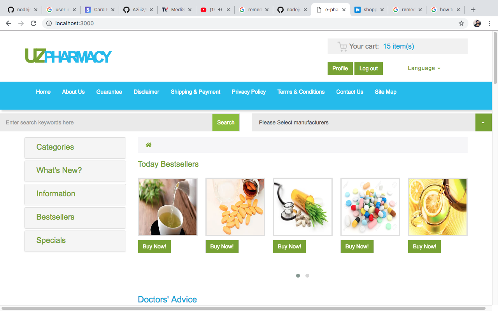
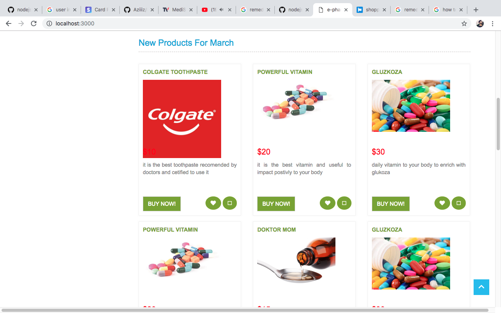
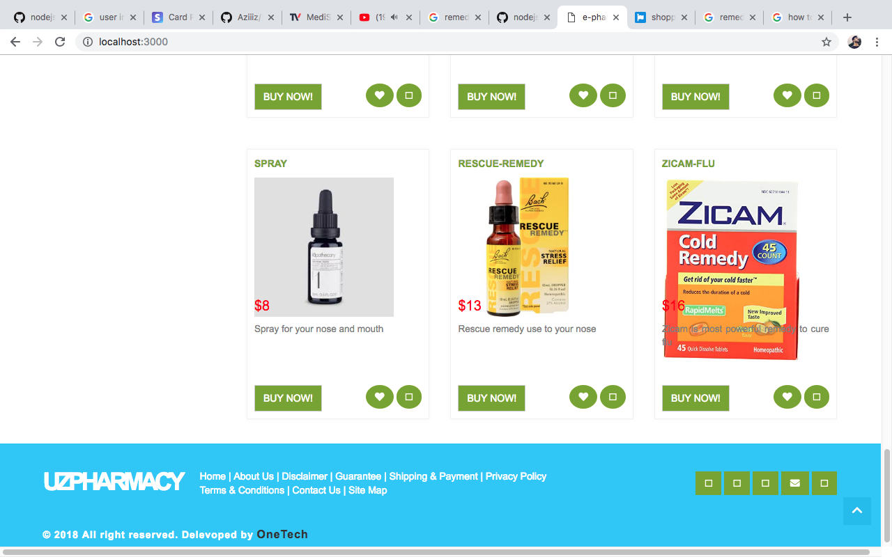

# E-pharmacy-web-app
E-pharm is e-commerce web base website. Build on  Mongo, Express, Handlebars(templating Engine) and Node.js. 
Group name "OneTech" 
group members: Aziz, Timur, Jakhongirmirzo

Basically, our project concerned to work in our country, to make a bridge between costumers and sellers.

We used Javascript as a main language for the front and back-end.

## install 
#### NODE.JS
#### MonngoDB
## DEpendincies
"bcrypt-nodejs": "0.0.3",
    "connect-flash": "^0.1.1",
    "connect-mongo": "^2.0.3",
    "cookie-parser": "~1.4.3",
    "csurf": "^1.9.0",
    "debug": "~2.6.9",
    "express": "~4.16.0",
    "express-handlebars": "^3.0.0",
    "express-session": "^1.15.6",
    "express-validator": "^5.3.0",
    "hbs": "~4.0.1",
    "http-errors": "~1.6.2",
    "mongoose": "^5.3.15",
    "morgan": "~1.9.0",
    "passport": "^0.4.0",
    "passport-local": "^1.0.0",
    "stripe": "^6.19.0"

